# 🚀 Project Analyzer Pro

<div align="center">

[](https://www.typescriptlang.org/)
[](https://reactjs.org/)
[](https://vitejs.dev/)
[](https://tailwindcss.com/)
[](https://www.radix-ui.com/)

**Transform your codebase into comprehensive, professional documentation with AI-powered analysis and multi-format export capabilities.**

[📖 Documentation](#-documentation) • [🎯 Features](#-features) • [🏗️ Architecture](#️-architecture) • [🚀 Quick Start](#-quick-start) • [🎨 UI Preview](#-ui-preview)

</div>

---

## 📋 Table of Contents

- [🎯 Features](#-features)
- [🏗️ Architecture Overview](#️-architecture-overview)  
- [📊 System Workflows](#-system-workflows)
- [🚀 Quick Start](#-quick-start)
- [🎨 UI Components](#-ui-components)
- [📦 Export Formats](#-export-formats)
- [⚡ Performance & Optimization](#-performance--optimization)
- [🔧 Configuration](#-configuration)
- [🛠️ Development](#️-development)
- [📚 API Reference](#-api-reference)
- [🤝 Contributing](#-contributing)
- [📄 License](#-license)

---

## 🎯 Features

### 🔥 Core Capabilities


### ✨ Advanced Features

- **🎯 Intelligent File Processing**: Automatically detects and processes 20+ file types with smart filtering
- **🧠 AI-Powered Documentation**: Generates detailed technical explanations for every code component  
- **📊 Visual Diagram Generation**: Creates architecture diagrams, flowcharts, and system relationships
- **🔄 Multi-Format Export**: Supports PDF, Markdown, PNG/JPG, JSON Schema, and structured prompts
- **📝 Copyable Code Blocks**: Every code snippet includes syntax highlighting and one-click copy functionality
- **🌙 Professional Dark UI**: High-contrast interface optimized for developer productivity
- **⚡ Performance Optimized**: Handles large codebases with intelligent chunking and memory management
- **🎨 Interactive Experience**: Real-time progress tracking and responsive feedback

---

## 🏗️ Architecture Overview

### System Architecture


### Component Architecture


---

## 📊 System Workflows

### File Upload & Processing Workflow


### Documentation Generation Process


### Export System Architecture

```mermaid
graph TB
    subgraph "Export Formats"
        PDF[📄 Comprehensive PDF]
        MD[📝 Detailed Markdown]
        TXT[📃 Consolidated Text]
        IMG[🖼️ Visual Diagrams]
        JSON[🔧 JSON Schema]
        QA[❓ Q&A Format]
        IMPL[📋 Implementation Guide]
        README[📖 Enhanced README]
    end
    
    subgraph "Processing Pipeline"
        Select[Format Selection] --> Generate[Content Generation]
        Generate --> Template[Apply Templates]
        Template --> Optimize[Content Optimization]
        Optimize --> Download[File Download]
    end
    
    subgraph "Content Types"
        Code[Code Blocks]
        Docs[Documentation]
        Diagrams[Visual Diagrams]
        Schema[API Schema]
    end
    
    Select --> PDF
    Select --> MD
    Select --> TXT
    Select --> IMG
    Select --> JSON
    Select --> QA
    Select --> IMPL
    Select --> README
    
    Code --> Generate
    Docs --> Generate
    Diagrams --> Generate
    Schema --> Generate
    
    classDef format fill:#3b82f6,stroke:#1e40af,color:#fff
    classDef process fill:#06b6d4,stroke:#0891b2,color:#fff
    classDef content fill:#10b981,stroke:#059669,color:#fff
    
    class PDF,MD,TXT,IMG,JSON,QA,IMPL,README format
    class Select,Generate,Template,Optimize,Download process
    class Code,Docs,Diagrams,Schema content
```



---

## 🚀 Quick Start

### Prerequisites

```bash
# Node.js 18+ and npm required
node --version  # Should be 18.0.0 or higher
npm --version   # Should be 8.0.0 or higher
```

### Installation

```bash
# Clone the repository
git clone https://github.com/Tim-Spurlin/project-analyzer-pro.git
cd project-analyzer-pro

# Install dependencies
npm install

# Start development server
npm run dev
```

### Development Commands

```bash
# 🔧 Development
npm run dev          # Start development server
npm run build        # Build for production
npm run preview      # Preview production build

# 🧹 Code Quality  
npm run lint         # Run ESLint (when configured)
npm run optimize     # Optimize Vite dependencies

# 🔥 Utilities
npm run kill         # Kill processes on port 5000
```

### First Run Experience


---

## 🎨 UI Components

### Design System Overview


### Component Hierarchy


---

## 📦 Export Formats

### Comprehensive Export Options


### Format Specifications

| Format | File Extension | Use Case | Features |
|--------|---------------|----------|----------|
| 📄 **Comprehensive PDF** | `.md` (rendered) | Complete documentation | Maximum content density, professional formatting |
| 📝 **Detailed Markdown** | `.md` | Developer documentation | Copyable code blocks, structured headers |  
| 📃 **Consolidated Text** | `.txt` | AI platform consumption | Optimized for token limits, dense content |
| 🖼️ **Visual Diagrams** | `.png/.jpg` | Architecture visualization | Mermaid-generated diagrams, annotations |
| 🔧 **JSON Schema** | `.json` | API documentation | Complete communication protocols, data structures |
| ❓ **Q&A Format** | `.md` | Knowledge transfer | Technical questions and detailed answers |
| 📋 **Implementation Guide** | `.md` | Development planning | Step-by-step tasks, technical specifications |
| 📖 **Enhanced README** | `.md` | Project documentation | Professional project overview with examples |

### Export Generation Process


---

## ⚡ Performance & Optimization

### Performance Metrics


### Memory Usage Patterns


### Optimization Features

- **🔄 Intelligent Chunking**: Automatically splits large files to respect AI token limits
- **💾 Efficient Caching**: Stores processing results to avoid redundant AI calls  
- **🎯 Selective Processing**: Only processes supported file types to save resources
- **⚡ Progress Streaming**: Real-time updates prevent UI blocking
- **🧠 Memory Management**: Automatic cleanup of large file content after processing
- **📊 Batch Processing**: Groups similar files for efficient AI analysis

---

## 🔧 Configuration

### Environment Configuration

```bash
# .env.local (create this file)
VITE_AI_MODEL_PREFERENCE=gpt-4  # AI model preference
VITE_MAX_FILE_SIZE=5242880      # Max file size in bytes (5MB)
VITE_PROCESSING_TIMEOUT=300     # Processing timeout in seconds
```

### Theme Customization

```json
// theme.json
{
  "extend": {
    "colors": {
      "primary": {
        "50": "#eff6ff",
        "500": "#3b82f6", 
        "900": "#1e3a8a"
      },
      "accent": {
        "50": "#ecfeff",
        "500": "#06b6d4",
        "900": "#164e63"
      }
    }
  }
}
```

### Supported File Types

```typescript
const SUPPORTED_EXTENSIONS = [
  // Programming Languages
  '.js', '.jsx', '.ts', '.tsx', '.py', '.java', '.cpp', '.c',
  '.cs', '.php', '.rb', '.go', '.rs', '.swift', '.kt', '.scala',
  
  // Web Technologies  
  '.html', '.css', '.scss', '.sass', '.less', '.vue', '.svelte',
  
  // Configuration & Data
  '.json', '.xml', '.yaml', '.yml', '.toml', '.ini', '.env',
  
  // Documentation
  '.md', '.rst', '.txt', '.adoc', '.tex',
  
  // Scripts & Tools
  '.sql', '.sh', '.bash', '.zsh', '.ps1', '.bat',
  '.dockerfile', '.gitignore', '.lock'
]
```

---

## 🛠️ Development

### Project Structure

```
project-analyzer-pro/
├── 📁 src/
│   ├── 📁 components/          # React components
│   │   ├── CodeBlockDisplay.tsx
│   │   ├── DocumentationGenerator.tsx  
│   │   ├── ExportSelector.tsx
│   │   ├── FileUpload.tsx
│   │   ├── ProcessingEngine.tsx
│   │   ├── ProjectStructure.tsx
│   │   └── 📁 ui/              # Reusable UI components
│   ├── 📁 hooks/               # Custom React hooks
│   ├── 📁 lib/                 # Utility libraries
│   ├── 📁 styles/              # CSS and theme files
│   ├── App.tsx                 # Main application component
│   └── main.tsx               # Application entry point
├── 📁 public/                  # Static assets
├── 📄 package.json            # Dependencies and scripts
├── 📄 tailwind.config.js      # Tailwind CSS configuration
├── 📄 vite.config.ts          # Vite build configuration
├── 📄 PRD.md                  # Product Requirements Document
└── 📄 README.md               # This documentation
```

### Development Workflow

```mermaid
gitgraph
    commit id: "Initial Setup"
    branch feature/ui-components
    checkout feature/ui-components
    commit id: "Add base components"
    commit id: "Implement dark theme"
    checkout main
    merge feature/ui-components
    
    branch feature/file-processing
    checkout feature/file-processing  
    commit id: "File upload system"
    commit id: "Content extraction"
    checkout main
    merge feature/file-processing
    
    branch feature/ai-integration
    checkout feature/ai-integration
    commit id: "AI service integration"
    commit id: "Documentation generation"
    checkout main
    merge feature/ai-integration
    
    branch feature/export-system
    checkout feature/export-system
    commit id: "Export formats"
    commit id: "Multi-format support"
    checkout main
    merge feature/export-system
```

### Testing Strategy


---

## 📚 API Reference

### Core Interfaces

```typescript
// Project data structure
interface ProcessedProject {
  name: string                    // Project name
  files: FileItem[]              // Array of processed files
  structure: ProjectStructure    // Nested file structure
  totalSize: number             // Total size in bytes
  fileCount: number             // Number of processed files
  uploadedAt: Date              // Upload timestamp
}

// Individual file representation
interface FileItem {
  name: string        // File name
  path: string        // Relative path from project root
  content: string     // File content
  size: number        // File size in bytes
  type: string        // File extension
}

// Extracted code component
interface ExtractedCode {
  id: string          // Unique identifier
  title: string       // Component title
  description: string // AI-generated description
  code: string        // Raw code content
  language: string    // Programming language
  filePath: string    // Source file path
  type: 'function' | 'class' | 'component' | 'config' | 'script' | 'style'
}

// Documentation section
interface GeneratedSection {
  id: string                // Unique identifier
  title: string            // Section title
  description: string      // Section description
  content: string          // AI-generated content
  codeBlocks: ExtractedCode[] // Related code blocks
}

// Export format configuration
interface ExportFormat {
  id: string           // Format identifier
  name: string         // Display name
  description: string  // Format description
  icon: React.ReactNode // UI icon
  estimatedSize: string // Estimated output size
  selected: boolean    // Selection state
  preview?: string     // Preview content
}
```

### Component Props

```typescript
// File upload component
interface FileUploadProps {
  onProjectUploaded: (project: ProcessedProject) => void
}

// Documentation generator component  
interface DocumentationGeneratorProps {
  project: ProcessedProject
  isProcessing: boolean
  onProcessingStart: () => void
  onProcessingComplete: () => void
}

// Export selector component
interface ExportSelectorProps {
  project: ProcessedProject
}

// Code block display component
interface CodeBlockDisplayProps {
  title: string
  description: string
  code: string
  language: string
  filePath?: string
  lineNumbers?: boolean
}
```

### Utility Functions

```typescript
// File type detection
const getFileIcon = (fileName: string, type: string): React.ReactNode

// File tree construction  
const buildFileTree = (files: FileItem[]): ProjectStructure

// Content optimization for AI consumption
const optimizeForTokenLimits = (content: string, maxTokens: number): string

// Export format generation
const generateExportContent = (
  formatId: string, 
  project: ProcessedProject,
  extractedCode: ExtractedCode[],
  generatedSections: GeneratedSection[]
): Promise<string>
```

---

## 🤝 Contributing

### Contribution Guidelines


### Development Setup

1. **Fork and Clone**
   ```bash
   git clone https://github.com/your-username/project-analyzer-pro.git
   cd project-analyzer-pro
   ```

2. **Install Dependencies**
   ```bash
   npm install
   ```

3. **Create Feature Branch**
   ```bash
   git checkout -b feature/your-feature-name
   ```

4. **Start Development**
   ```bash
   npm run dev
   ```

### Code Standards

- **TypeScript**: Strict mode enabled, full type coverage required
- **React**: Functional components with hooks, proper prop typing
- **Styling**: Tailwind CSS with consistent design tokens
- **Testing**: Unit tests for utility functions, component tests for UI
- **Documentation**: JSDoc comments for public APIs

### Pull Request Process

1. Ensure all tests pass and code builds successfully
2. Update documentation for new features or API changes  
3. Follow conventional commit message format
4. Include screenshots for UI changes
5. Reference related issues in PR description

---

## 🔒 Security & Privacy

### Data Handling


### Privacy Principles

- **🔒 Local-First**: All file processing happens locally in your browser
- **🛡️ Minimal AI Sharing**: Only text content sent to AI services, never file metadata
- **🚫 No Storage**: No files stored on external servers
- **🧹 Auto-Cleanup**: Memory automatically cleared after processing
- **👤 User Control**: Complete control over what gets processed and exported

---

## 📊 Performance Benchmarks

### Processing Speed Metrics


### Memory Usage Patterns

```mermaid
sankey-beta
    "Total Memory" ,[Project Files],40
    "Total Memory" ,[UI Components],20  
    "Total Memory" ,[Processing Cache],25
    "Total Memory" ,[AI Responses],15
    
    [Project Files] ,[File Content],35
    [Project Files] ,[Metadata],5
    
    [UI Components] ,[React State],12
    [UI Components] ,[DOM Elements],8
    
    [Processing Cache] ,[Code Extraction],15
    [Processing Cache] ,[Documentation],10
    
    [AI Responses] ,[Generated Content],15
```

---

## 🚀 Deployment

### Build Configuration

```bash
# Production build
npm run build

# Preview production build  
npm run preview

# Build with custom settings
VITE_BUILD_TARGET=modern npm run build
```

### Deployment Options


### Environment Variables

```bash
# Production environment
VITE_APP_TITLE="Project Analyzer Pro"
VITE_APP_DESCRIPTION="AI-powered project documentation generator"
VITE_ENABLE_ANALYTICS=true
VITE_SENTRY_DSN=your_sentry_dsn_here
```

---

## 🔍 Troubleshooting

### Common Issues & Solutions

```mermaid
flowchart TD
    Issue1[Files Not Uploading] --> Check1{File Size < 5MB?}
    Check1 -->|No| Solution1[Reduce file size or exclude large files]
    Check1 -->|Yes| Check2{Supported file type?}
    Check2 -->|No| Solution2[Check supported extensions list]
    Check2 -->|Yes| Solution3[Check browser console for errors]
    
    Issue2[AI Processing Fails] --> Check3{Internet connection?}
    Check3 -->|No| Solution4[Check network connection]
    Check3 -->|Yes| Check4{Token limits exceeded?}
    Check4 -->|Yes| Solution5[Reduce project size or chunking]
    Check4 -->|No| Solution6[Retry with different AI model]
    
    Issue3[Export Not Working] --> Check5{Format selected?}
    Check5 -->|No| Solution7[Select at least one export format]
    Check5 -->|Yes| Check6{Browser blocking downloads?}
    Check6 -->|Yes| Solution8[Enable downloads in browser settings]
    Check6 -->|No| Solution9[Check browser console for errors]
    
    style Issue1,Issue2,Issue3 fill:#ef4444
    style Solution1,Solution2,Solution3,Solution4,Solution5,Solution6,Solution7,Solution8,Solution9 fill:#10b981
```

### Debug Mode

Enable debug logging by adding to your browser console:

```javascript
// Enable debug mode
localStorage.setItem('DEBUG', 'true')

// View processing logs
localStorage.setItem('VERBOSE_LOGGING', 'true')  

// Clear debug data
localStorage.removeItem('DEBUG')
localStorage.removeItem('VERBOSE_LOGGING')
```

---

## 📈 Roadmap

### Planned Features

```mermaid
timeline
    title Project Analyzer Pro Roadmap
    
    section Q1 2024
        Core Features    : File Upload System
                         : AI Integration
                         : Basic Export Formats
    
    section Q2 2024  
        Enhanced UI      : Dark Mode Polish
                         : Advanced Code Display
                         : Progress Indicators
    
    section Q3 2024
        Advanced Exports : Visual Diagram Generation
                         : JSON Schema Output
                         : Q&A Format Support
    
    section Q4 2024
        Performance      : Large File Optimization
                         : Batch Processing
                         : Memory Management
                         
    section 2025
        New Features     : Custom Templates
                         : Plugin System
                         : Collaboration Tools
                         : API Endpoints
```

---

## 🌟 Acknowledgments

### Technologies Used

- **⚛️ React 19**: Modern React with hooks and concurrent features
- **⚡ Vite**: Lightning-fast build tool and development server
- **🎨 Tailwind CSS**: Utility-first CSS framework with design system
- **🔧 Radix UI**: Accessible, unstyled UI components  
- **🎯 TypeScript**: Type-safe JavaScript development
- **🤖 GitHub Spark**: AI integration platform and hosting
- **📊 Mermaid**: Diagram generation for documentation
- **🎨 Phosphor Icons**: Beautiful, consistent icon set

### Contributors

Special thanks to all contributors who help make Project Analyzer Pro better!

---

## 📄 License

```
MIT License

Copyright (c) 2024 Project Analyzer Pro

Permission is hereby granted, free of charge, to any person obtaining a copy
of this software and associated documentation files (the "Software"), to deal
in the Software without restriction, including without limitation the rights
to use, copy, modify, merge, publish, distribute, sublicense, and/or sell
copies of the Software, and to permit persons to whom the Software is
furnished to do so, subject to the following conditions:

The above copyright notice and this permission notice shall be included in all
copies or substantial portions of the Software.

THE SOFTWARE IS PROVIDED "AS IS", WITHOUT WARRANTY OF ANY KIND, EXPRESS OR
IMPLIED, INCLUDING BUT NOT LIMITED TO THE WARRANTIES OF MERCHANTABILITY,
FITNESS FOR A PARTICULAR PURPOSE AND NONINFRINGEMENT. IN NO EVENT SHALL THE
AUTHORS OR COPYRIGHT HOLDERS BE LIABLE FOR ANY CLAIM, DAMAGES OR OTHER
LIABILITY, WHETHER IN AN ACTION OF CONTRACT, TORT OR OTHERWISE, ARISING FROM,
OUT OF OR IN CONNECTION WITH THE SOFTWARE OR THE USE OR OTHER DEALINGS IN THE
SOFTWARE.
```

---

<div align="center">

**Built with ❤️ by the Project Analyzer Pro team**

[⬆️ Back to Top](#-project-analyzer-pro) • [🐛 Report Bug](https://github.com/Tim-Spurlin/project-analyzer-pro/issues) • [💡 Request Feature](https://github.com/Tim-Spurlin/project-analyzer-pro/issues)

</div>